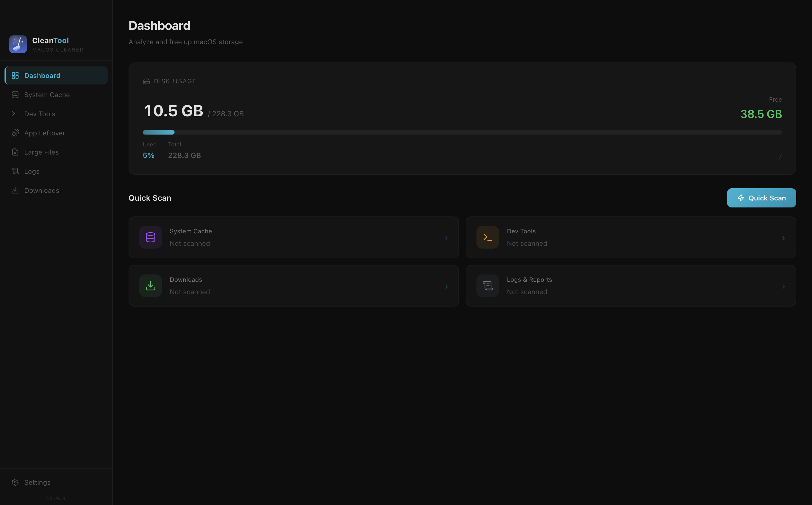
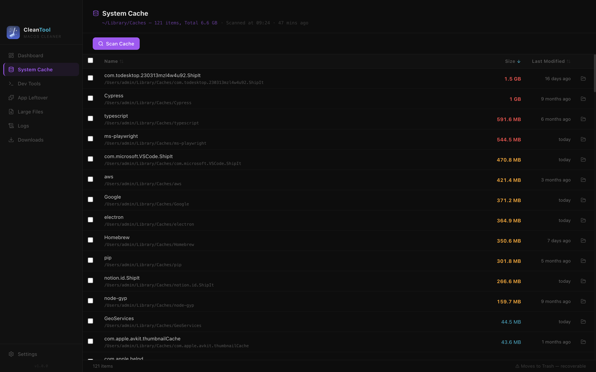
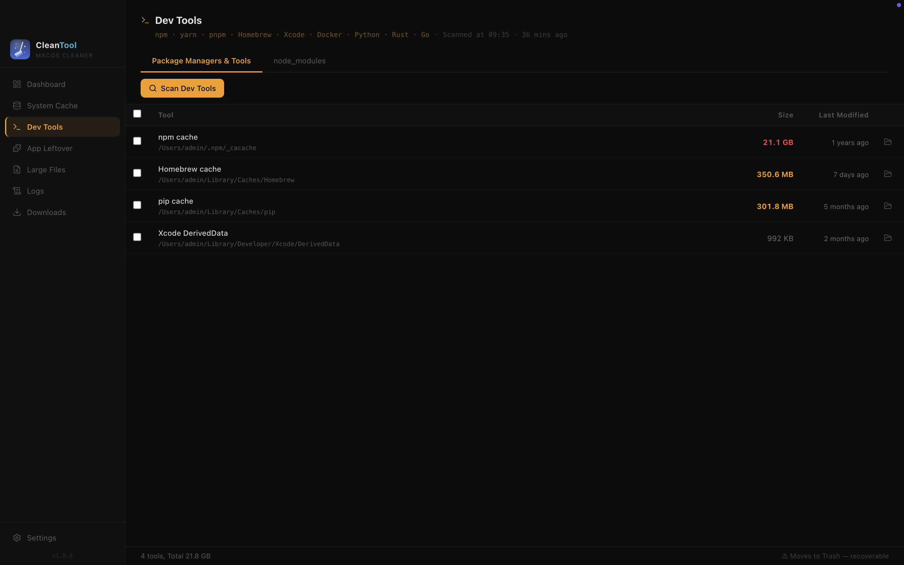
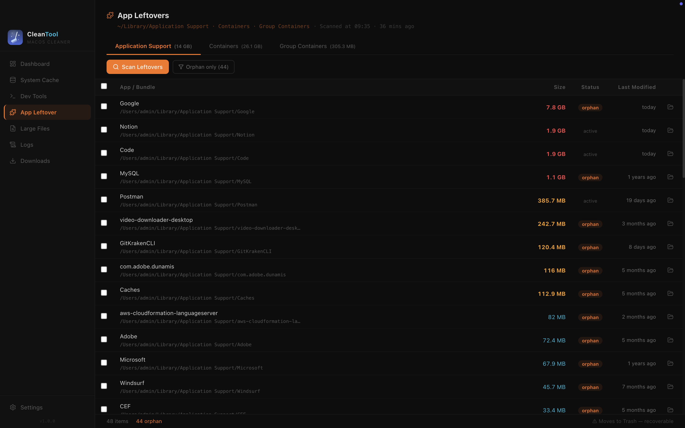

<div align="center">
  
  <h1>CleanTool</h1>
  <p>A lightweight macOS disk cleaner built with Electron, React, and TypeScript.<br/>Everything moves to <strong>Trash</strong> — nothing is permanently deleted.</p>

  <p>
    
    
    
    
    
  </p>
</div>

---

## Screenshots

<table>
  <tr>
    <td></td>
    <td></td>
  </tr>
  <tr>
    <td align="center"><em>Dashboard — disk usage at a glance</em></td>
    <td align="center"><em>System Cache — sort and clean app caches</em></td>
  </tr>
  <tr>
    <td></td>
    <td></td>
  </tr>
  <tr>
    <td align="center"><em>Dev Tools — package manager & node_modules caches</em></td>
    <td align="center"><em>App Leftovers — orphaned data from uninstalled apps</em></td>
  </tr>
</table>

---

## Features

### Dashboard
Real-time disk usage with total, used, and free space. A color-coded bar shifts from green to amber to red as the disk fills. One-click **Quick Scan** estimates reclaimable space across every category instantly.

### System Cache
Scans `~/Library/Caches` and lists each subdirectory with its size and last-modified date. Sort by name, size, or date. Select individual items or all at once, then move them to Trash in a single click.

### Dev Tools
Two focused sub-sections for developers:

**Package Manager Caches** — automatically detects and reports the size of caches for:
`npm` · `Yarn` · `pnpm` · `Bun` · `Homebrew` · `Xcode DerivedData` · `iOS DeviceSupport` · `Simulator runtimes` · `CocoaPods` · `pip` · `Gradle` · `Cargo` · `Go modules`

**node_modules Finder** — recursively searches your configured directories for `node_modules` folders across all projects. Shows each folder's size and last-used date so you can safely remove stale dependencies from old projects.

### App Leftovers
Scans:
- `~/Library/Application Support`
- `~/Library/Containers`
- `~/Library/Group Containers`

Compares every entry against your installed apps (`/Applications` + `~/Applications`) and flags **orphans** — data left behind by apps you have already uninstalled. Orphaned entries are clearly highlighted so you can clean them up with confidence.

### Large Files
Searches your entire home folder for files above a configurable size threshold (default: 100 MB). Results are grouped by type:

| Type | Extensions |
|------|-----------|
| Video | mp4, mov, avi, mkv, m4v, wmv, flv, webm |
| Disk Image | dmg, iso, img, sparseimage |
| Archive | zip, tar, gz, bz2, rar, 7z, tgz |
| Document | pdf, doc, docx, ppt, pptx, xls, xlsx, pages, numbers, key |
| Image | jpg, jpeg, png, gif, bmp, tiff, heic, raw, psd |

Sort by size or date. Click the folder icon next to any entry to reveal it in Finder.

### Logs & Reports
Scans:
- `~/Library/Logs` — user application logs
- `~/Library/Logs/DiagnosticReports` — crash reports
- `/Library/Logs` — system-level logs

Displays age in days so stale, safe-to-remove logs are easy to identify.

### Downloads
Lists everything in `~/Downloads` with file-type detection, size, and age in days — perfect for clearing out accumulated installers, archives, and media files.

### Settings
- **Scan roots** — directories to search for `node_modules` (one path per line)
- **Large file threshold** — minimum size in MB for the Large Files scan
- **Unused days threshold** — files older than this are flagged as stale

---

## Safety

> **CleanTool never permanently deletes files.**
> Every removal moves items to the macOS Trash. You can restore anything at any time from Trash in Finder.

---

## Installation

1. Download the latest `.dmg` from the [Releases](../../releases) page.
2. Open the `.dmg`, then drag **CleanTool** to your Applications folder.
3. If macOS shows a security warning, run this command once in Terminal to activate the app:
   ```bash
   xattr -cr /Applications/MacCleanTool.app
   ```
4. Launch CleanTool from Applications or Spotlight.

---

## Requirements

- macOS 11 Big Sur or later
- Apple Silicon or Intel

---

## Development

```bash
# Install dependencies
npm install

# Run in development mode (hot reload)
npm run dev

# Build distributable (.dmg)
npm run electron:build
```

### Tech Stack

| Layer | Technology |
|-------|-----------|
| Shell | Electron 30 |
| UI | React 18 + TypeScript 5 |
| State | Zustand |
| Bundler | Vite |
| Styles | Tailwind CSS |
| Packaging | electron-builder |

---

## Contributing

Pull requests are welcome. For major changes, please open an issue first to discuss what you would like to change.

---

## License

[MIT](LICENSE)
